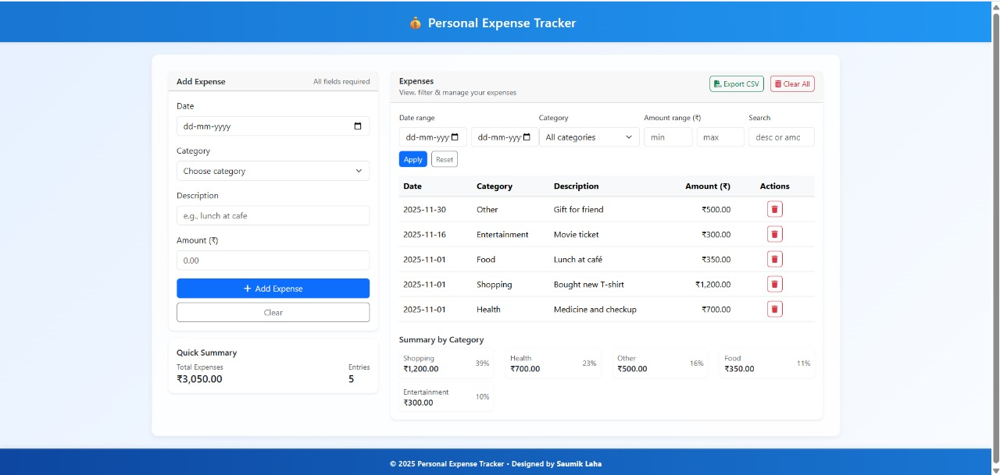

# 💰 Personal Expense Tracker

A simple and elegant **Personal Expense Tracker Web App** that helps you record, categorize, and visualize your daily expenses easily.  
Built with **HTML, CSS, and JavaScript**, this project allows users to add, view, and manage their expenses in a clean and responsive UI.

---

## 🚀 Live Demo
👉 [Click Here to View Live Project](https://personal-expense-tracker-by-laha.netlify.app/)

---

## 🖼️ Screenshot


---

## 🎯 Features

✅ Add new expenses with date, category, description, and amount  
✅ Categories include: Food, Shopping, Education, Health, Entertainment, and Other  
✅ Instant validation — all fields required before adding  
✅ Responsive design with a clean layout and light background  
✅ Simple UI with total expense calculation  

---

## 📅 Example Entries

| Date       | Category       | Description                      | Amount (₹) |
|-------------|----------------|----------------------------------|-------------|
| 2025-11-01  | 🍔 Food         | Lunch at café 😋                | 350         |
| 2025-11-01  | 🛍️ Shopping     | Bought new shoes 👟             | 1200        |
| 2025-11-01  | 🎓 Education    | Purchased course material 📘    | 800         |
| 2025-11-01  | 🏥 Health       | Doctor visit 💊                 | 500         |
| 2025-11-01  | 🎬 Entertainment| Watched movie with friends 🎞️  | 450         |
| 2025-11-01  | 💼 Other        | Lunch at café 🍽️               | 350         |

---

## 🛠️ Tech Stack
- **HTML5**
- **CSS3 / Bootstrap 5**
- **JavaScript / jQuery**
- **LocalStorage API**

---

## ⚙️ How to Run Locally

1. Clone the repository  
   ```bash
   git clone https://github.com/SaumikLaha/Personal-Expense-Tracker-project.git
Open the project folder

cd Personal-Expense-Tracker-project


Open index.html in your browser

start index.html
---

## 👨‍💻 Author

Saumik Laha
📧 Email: saumiklaha@gmail.com

🌐 GitHub: SaumikLaha

🔗 Live Demo: personal-expense-tracker-by-laha.netlify.app
---
---

## ⚖️ License

This project was developed as part of the **Full Stack Web Development Internship** offered by **1Stop.ai**.  
It is recognized as **Frontend Project – 2nd** under the internship training module.

---

### 🧑‍💻 Intern Details
- **Name:** Saumik Laha  
- **Email:** [saumiklaha@gmail.com](mailto:saumiklaha@gmail.com)  
- **Domain:** Frontend Project (Personal Expense Tracker) 

---

© 2025 Saumik Laha.  
This project is licensed for **educational and internship purposes only**.  
Unauthorized **commercial use** or **redistribution** is strictly prohibited.
